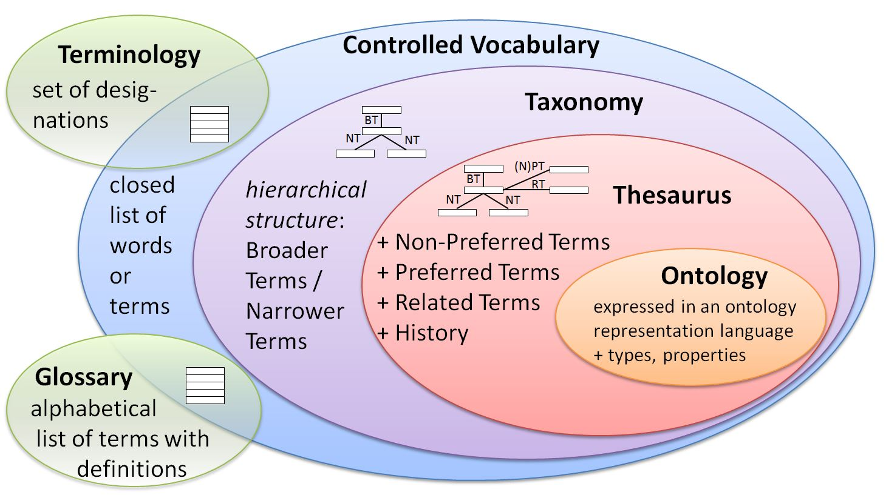

# Introduction to classification

Classification is a form of categorization, that groups objects  or items according to their subjects usually arranged in a hierarchical tree structure. This knowledge organization technique can take many forms, that will be discussed below.

## Controlled vocabularies

Controlled vocabulary is a **closed list of words or terms** that have been enumerated explicitly, which can be used for classification. It is controlled because only terms from the list maybe used, and because there is control over who, when and how adds terms to the list.

## Terminologies

Terminology is a set of designations belonging to one special language. A more simple definition for terminology is that is a list of special words or phrases that are used in a particular field.

## Glossaries

Glossary is an alphabetical list of terms in a particular domain of knowledge with the definitions for those terms. It is a specialized vocabulary with definitions but does not provide other information about the words.

## Taxonomies

Taxonomy is a **collection of controlled vocabulary terms organized into a hierarchical structure** by applying parent-child (broader/narrower) relationship. Each term in a taxonomy is in one or more relationships (e.g. whole-part, type-instance) to other terms in the taxonomy.

## Thesauri

**Thesaurus is a more structured, much richer taxonomy, that uses associative relationships (like "related term")** in addition to parent-child relationships.

## Ontologies

**Ontology is a more complex type of thesaurus expressed in an ontology representation language** that consists of a set of types, properties and relationship types. In an ontology instead of having simply "related term" relationship, **there are various customized relationship pairs that contain specific meaning**, such as "owns" and a reciprocal "is owned by".

