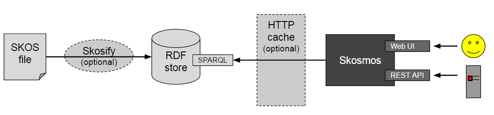

# Selected tool: Skosmos with Jena-Fuseki

All of the tested tools have advantages and disadvantages, but the most important selection criteria for us were to find an open source tool that is based on the stable and widespread Jena technology which can also provide a SPARQL Endpoint and access via REST API. 
For these selection criteria, Skosmos with Jena Fuseki seemed to be the best solution, therefore we have selected it for implementing our Classification Server.

The classification server will be implemented using Skosmos as a frontend for handling SKOS vocabularies, and Jena Fuseki as a SPARQL Endpoint storing the SKOS vocabulary data (see Fig.1.).

Jena Fuseki is a SPARQL server and RDF triple store which is the recommended backend for Skosmos. 
The jena-text extension can be used for faster text search.

Alternatively, we could use any other SPARQL 1.1 compliant RDF store, but the performance will likely not be very good with large vocabularies since there is no text index support in generic SPARQL 1.1.

