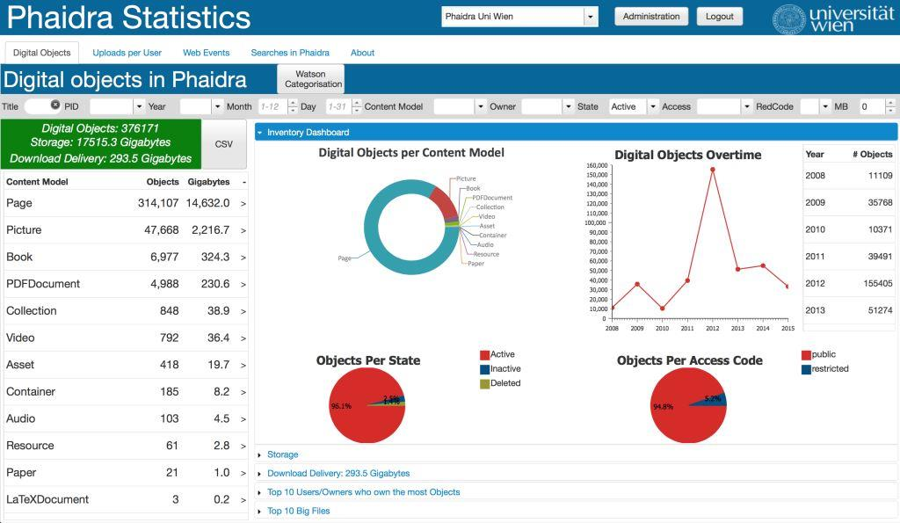

# Phaidra Statistics 

**Phaidra Statistics** is a web based application that facilitates the analysis of the inventory of digital objects managed by Phaidra Repositories, and their related Piwik web events activity.

##Sample view

##Selected Features:
#####Unified information about Inventory and Web Activity (Download Delivery)
Phaidra Statistics unifies the information of the inventory of digital objects (Phaidra Repository data) with the Download Delivery -the amount of downloads by the users (data from Piwik). 

Phaidra Statistics facilitates the Repository Manager with one interface for all information regarding the Storage and Use of the Repository.
#####Storage 
information about storage consumed by the digital objects
#####Multirepository
Allows data of several repositories

#####Search
Allows for extensive filtering

###Download from Github
The application can be downloaded from GitHub

##Phaidra Statistics Administration 
Phaidra Statistics includes a management application to administer Users (username, passwords, sites allowed) and Instances of Phaidra to be analyzed (Sites).

Please see document “Phaidra Statistics Administration” for more details.

##Phaidra Repository

Phaidra is the repository of the University of Vienna

###[phaidra.univie.ac.at](phaidra.univie.ac.at)

