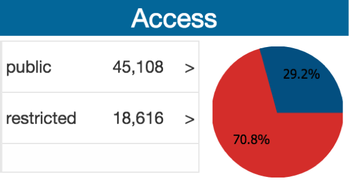

# Access

Shows information regarding the access of the objects: restricted, public, all.

##Widgets: Grid and Chart

### Grid

|Component | Data Flow |
| -- | -- |
|Variable | Svgettotalsyearsinit |
|Java| gettotalyears |
|Variable| vartotalsyearsforchar |
|Widget | Chart? |

### Chart

|Component | Data Flow |
| -- | -- |
|Variable | Svgettotalsyearsinit |
|Java| gettotalyears |
|Variable| vartotalsyearsforchar |
|Widget | Chart? |

