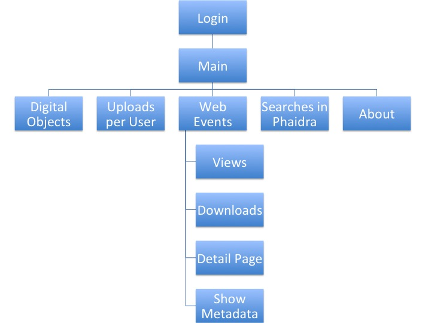

# Application Structure - Pages

Phaidra Statistics is structured in several pages.

**Page Login** 

Page to log in into the application. The users and passwords are managed by the site administrator.

**Page Main**

Contains general information and displays the different subpages

**Page Digital Objects**

Displays detailed information about the inventory of digital objects (how many objects, content models, etc.) stored in the selected Phaidra Instance.

**Page Uploads per User**

Displays detailed information, organized per owner, about the digital objects uploaded in the selected Phaidra Instance.

**Page Searches**

Displays information about the searches performed by the Users of a given Phaidra Instance.

**Page Webevents**

Displays detailed information about the Web Events corresponding to the digital objects stored in the selected Phaidra Instance. The Web Events data is provided by the  Piwik installation for the selected Phaidra Instance.

The Webevents Page has the following subpages
* Object Profile
* Views
* Downloads
* Detail Page
* Show Metadata

***Page Object Profile***

Displays detailed information about the Web Events for a given digital object stored in the selected Phaidra Instance.

***Page Views***

Displays detailed information about the Views Web Event for the digital objects stored in the selected Phaidra Instance.

***Page Downloads***

Displays detailed information about the Download Web Event for the digital objects stored in the selected Phaidra Instance.

***Page Detail Page***

Displays detailed information about the Detail Page Web Event for the digital objects stored in the selected Phaidra Instance.

***Page Show Metadata***

Displays detailed information about the Show Metadata Web Event for the digital objects stored in the selected Phaidra Instance.

