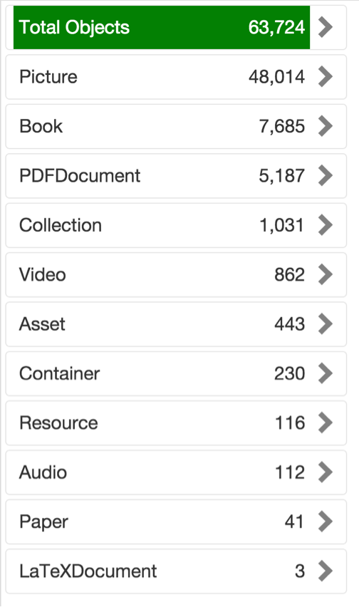
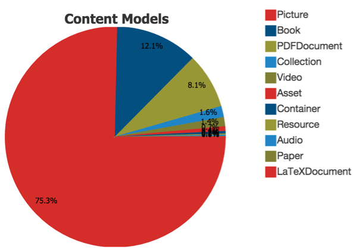

# Content Models

Shows information about content models 

##Widgets: List and Chart

###List

|Component | Data Flow |
| -- | -- |
| service variable | serviceVariable1 |
|Java | invgetcmodels |
|Variable | varcmodels |
|Widget | list1 |

###Chart 
|Component | Data Flow |
| -- | -- |
|Variable | varcmodelsforchart |
|gets data from | varcmodels |
|Widget | chartcmodels |

