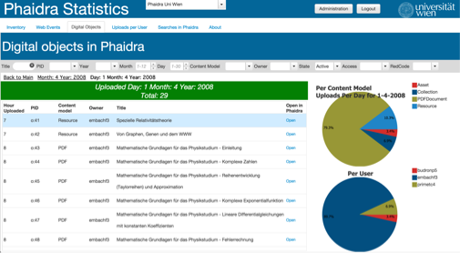
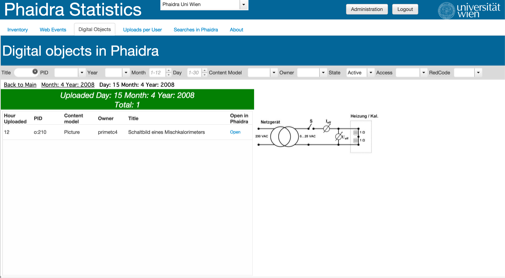

# Object or List of Objects

###If more than one Object

If there is more than one digital object for the Day and Month selected, displays a  list of digital objects for the selected Month and Day.

###otherwise
Displays information about the digital object including an image of the object.

##Widgets: chart and grid

###Chart

###Grid

|Item | Value |
| -- | -- |
|Variable | svgetcreateionday|
|Java| getcreateionday |
|Variable| varuploadsperday |
|Widget | dojoGridcmodels3 |