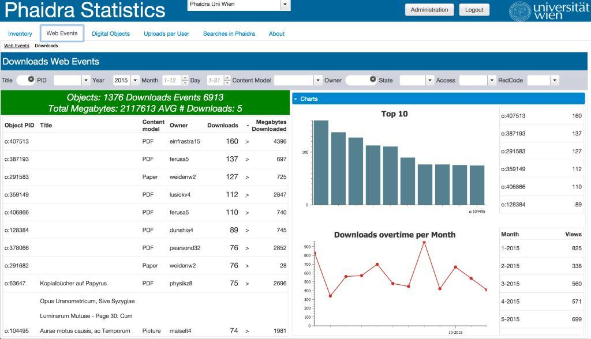

# Download Delivery

Download Delivery means "the total bytes downloaded by users of Phaidra". The application calculates the amount of bytes downloaded based on the Piwik Webevents type "Download" (whenever a user downloads a file from Phaidra).

You can find storage and download delivery (for Webevents type Download) related information in the following manners:
##Page Digital Objects

##Webevent Downloads: Total Downloaded Gigabytes per Object
You can see the Total of Downloaded Gigabytes (Download Delivery), or filter per Object, Owner, Content Model,etc

