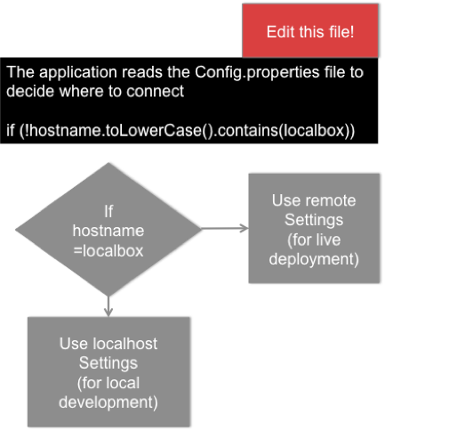

# How Config.properties works

The settings of this file allow the developer to use the local instance of MySql or to use a given instance (Production, Testing, etc) when the application is deployed to the production application server (or testing, etc)

The settings in this file indicate the application where the location of the database is and the location of the localhost is. 

The diagram on the right explains how the application works using the  settings in Config.properties

