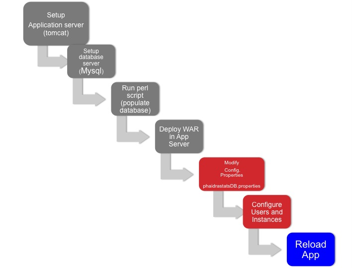

# Implementation Workflow
There are few configuration steps to follow before deploying Phaidra Statistics: Application and Database setup, Populate databases. 

Once the Phaidra Statistics Application (war file) has been deployed, you will need to configure 2 files to match your environment settings (Config.properties and phaidrastastDB.properties) and reload the application.

To login, you will need to configure users and instances using the Phaidra Statistics Administration application.

#Modify Config.properties (Java Calls)
See Config.properties 

#Modify phaidrastatsDB.properties (Hibernate Calls)
See phaidrastatsDB.properties 

#Reload
Once the WAR file has been deployed,  the Database Settings have been configured (Config.properties and phaidrastatsDB.properties), and the Users and Roles have been setup, reload the application in your application server 

**Do not redeploy the war file, otherwise the settings will be lost.**

##Phaidra Repositories and User Management
Once Phaidra Statistics has been installed, **it is necessary **to configure the Repositories available to Phaidra Statistics, and the Users allowed to login and use Phaidra Statistics.

This configuration is performed using the Phaidra Statistics Administration application.

Make sure you have at least one User with status "Active"  (in table users), otherwise you will not be able to log in into the Phaidra Statistics  application
