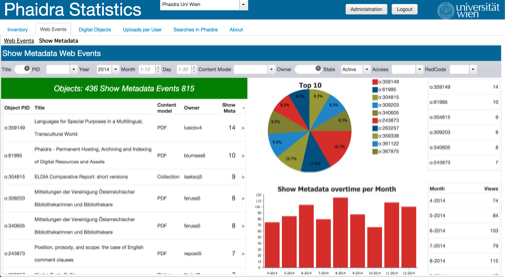

# Overview

Displays summary information about the Show Metadata Web Events for the digital objects stored in the selected Phaidra Instance.

## Grid

|Item | Value |
| -- | -- |
|Variable | svdetailpage |
|Java| showmetadata |
|Variable| vardetailpage |
|Widget |dojoGridDetailPage|

## Chart Top 10

|Item | Value |
| -- | -- |
|Variable | svdetailpage |
|Java| showmetadata |
|Variable| varforcharttop |
|Widget | dojoChartDetailPagePerOwner |

## Chart Downloads overtime

|Item | Value |
| -- | -- |
|Variable | svdetailpageovertime |
|Java| showmetadataovertime |
|Variable| vardetailpageovertime |
|Widget | dojoChartDetailPageovertime |