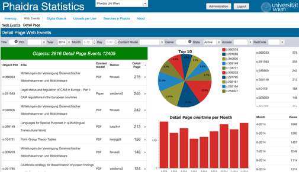

# Page Detail Page

Displays detailed information about the Detail Page Web Event for the digital objects stored in the selected Phaidra Instance.

This page is displayed in a page container located inside the layer of the webevents page.

####This page is only available when the user selects a "Detail Page" event history on the page "Overview of Web Events".

##Layer
**internal name: breadcrumbLayers1.layerDetailPageNews**

##Page
**internal name: detailpage**

