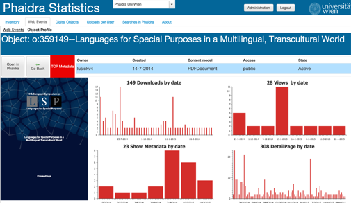

# Page Object Profile - Widgets

Displays detailed information about the Web Events for a given digital object stored in the selected Phaidra Instance.

This is not really a "page" but a "tab layer". 

##Layer
**internal name: breadcrumbLayers1.layerPID**

##Page
**internal name: webevents**

