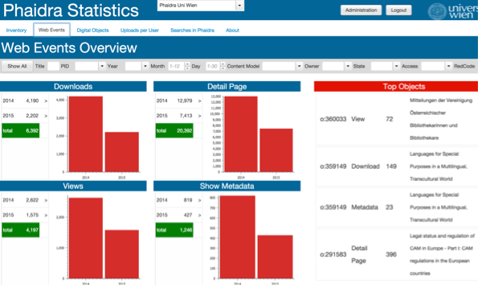

# Layer Overview

Displays detailed information about the Web Events corresponding to the digital objects stored in the selected Phaidra Instance. 

This is not really a "page" but a "breadcrums layer".

All Widgets are located in a panel inside the layer.

**From this page is possible to get detailed information regarding the different web events: Downloads, Views, Show Metadata and Detail Page. It is possible by clicking on the values or on the charts.**

##Layer
**internal name: breadcrumbLayers1.layerPiwik**

##Page
**internal name: webevents**
