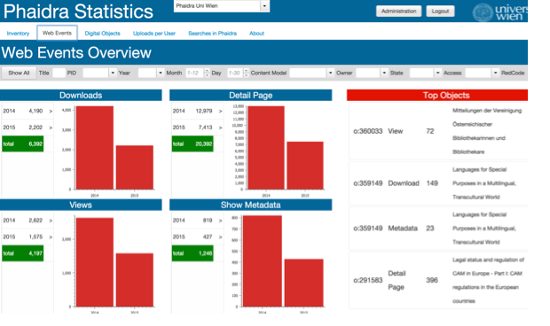

# Page webevents-Widgets

Displays detailed information about the Web Events corresponding to the digital objects stored in the selected Phaidra Instance. The Web Events data is provided by the  Piwik installation for the selected Phaidra Instance.

The information on this page is organized in a breadcrums layers Widget

####Subpages Download, Views, Show Metadata and Detail Pge are only available when the user selects an event history on this page

**internal name: breadcrumbLayers1.layerPiwik**

##Layers
* Overview (Piwik)
* Object Profile (PID)
* Downloads
* Views
* Show Metadata
* Display page

