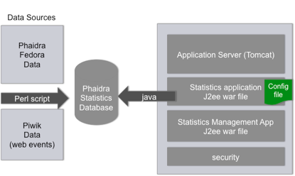

# Phaidra Statistics Server Technologies and Components

The application is a J2EE Spring application. It is deployed on an application server as a WAR file.  It uses a MySql database as datasource. This database is fed information from Phaidra Instances (fedora commons) and Piwik Web Events.  It uses a local Config.properties file to connect to the appropriate Database Services.

#Server Components
* Data Sources
* Perl Script
* Database
* Application Server
* Config.properties
* Spring settings
