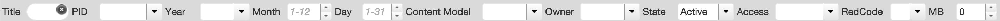

# Search Box
All pages have a search box to filter data. You can filter by several fields.

##Title
Search Objects per Title
##PID
Search Objects per Permanent Identifier. To search you have to include the "o:" prefix, like this:

**o:12345**

##Year
Search Objects per year of upload in repository. You can select one from the list or enter a specific year.

##Month
Search Objects per month of upload in repository

##Day
Search Objects per day of upload in repository

##Content Model
Search Objects per Content Model

##Owner
Search Objects per owner of object

##State
Search Objects per State
* Active
* Inactive
* Deleted

##Access
Search Objects per access
* Public: everyone can see it
* Private

##RedCode
* DV
* XX
* XV
* BV
* VR

##MB
Search Objects with file size bigger than X Megabytes