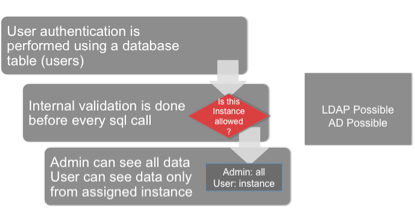

# Security Model
The  Security Model is multilayer, includes:
* Login Authentication
* User verification for SQL Calls
* User settings via Phaidra Statistics Administration
* SSL support
* SSH Tunneling
* LDAP/AD Services
* Spring Services

#Authentication Flow

# User Database Table for Login
The application uses a database table to authenticate users (login). User information (username, passwords, etc.) is managed using the Phaidra Statistics Management Application. 

#Active Users
Only "Active" users can log in into Phaidra Statistics. User Management is performed with the Phaidra Statistics Administration application.

More information regarding User configuration can be found in the Phaidra Statistics Administration documentation.
