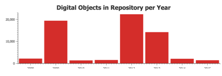
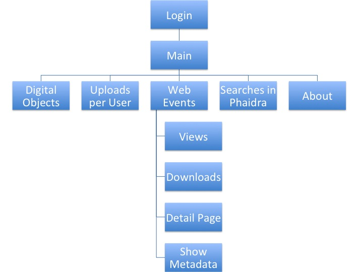

# Detail Information from Client Widgets and Java Services on all the pages

This section documents the different components (Widgets) in use by the application and the data flow (how the components are interconnected with corresponding Java services). The documentation includes the names of all variables and services used in the WaveMaker application.

#Sample Widget (Chart)

#Pages
The sections are organized by Page (or Tab) in the application.

