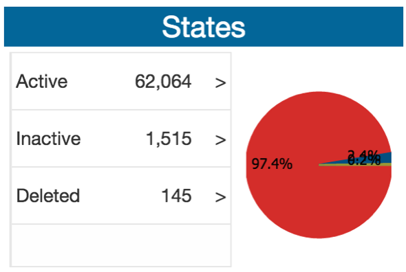

# States

Shows information regarding the states of the objects: active, inactive, deleted, all. 

##Widgets: Grid and Chart

### Grid

|Component | Data Flow |
| -- | -- |
|Service Variable | svgettotalsyearsinit |
|Java| gettotalyears |
|Variable| vartotalsyearsforchar |
|Widget | Chart? |

### Chart

|Component | Data Flow |
| -- | -- |
|Service Variable | svgettotalsyearsinit |
|Java| gettotalyears |
|Variable| vartotalsyearsforchar |
|Widget | Chart? |

