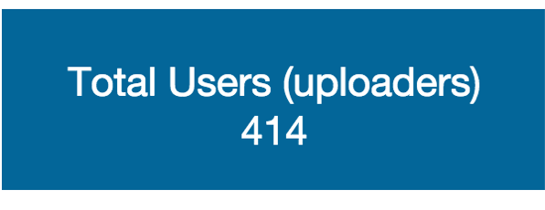

# Total Users
Label to show the number of users in selected instance. Startup variable.

##Widget: Label

|Component | Data Flow |
| -- | -- |
|Variable | svgettotalsyearsinit |
|Java| gettotalyears |
|Variable| vartotalsyearsforchar |
|Widget | Chart? |

