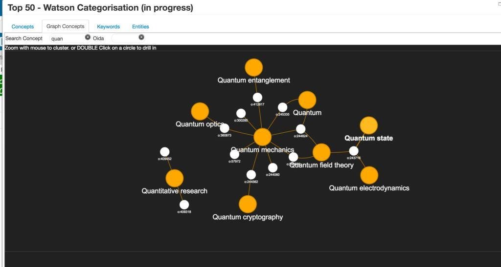
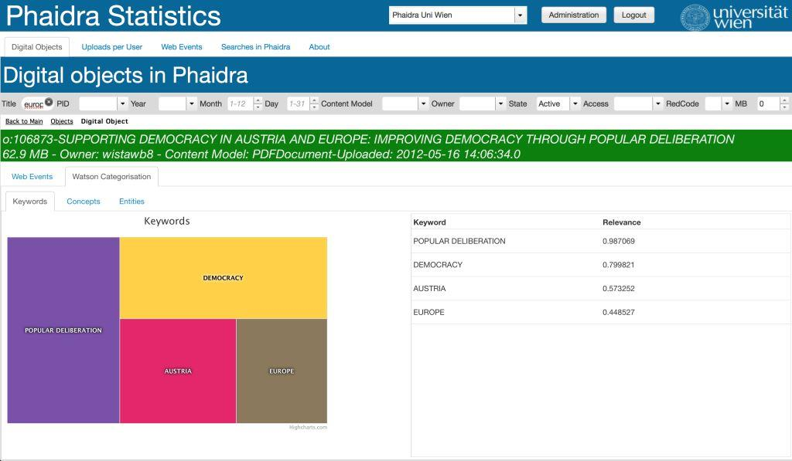
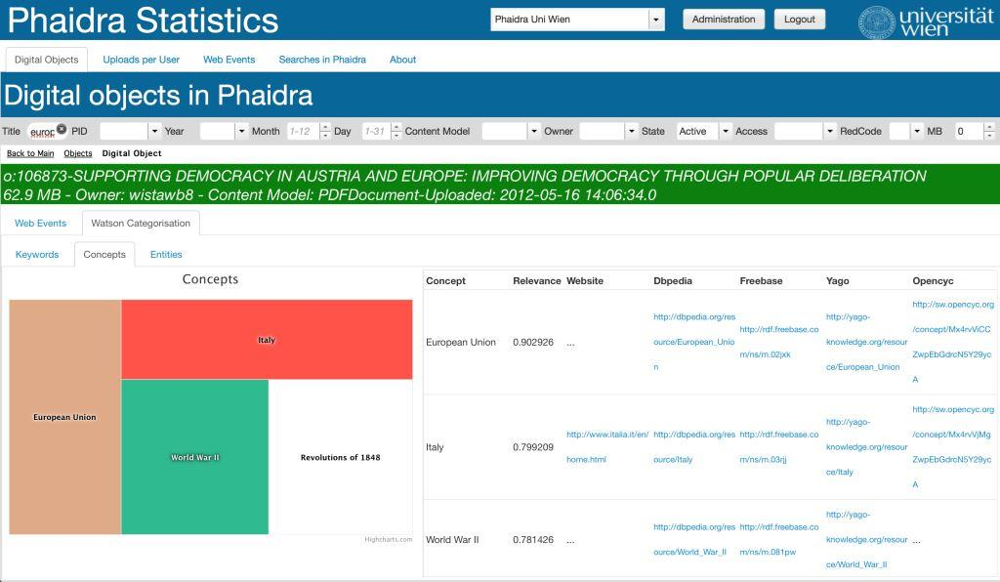
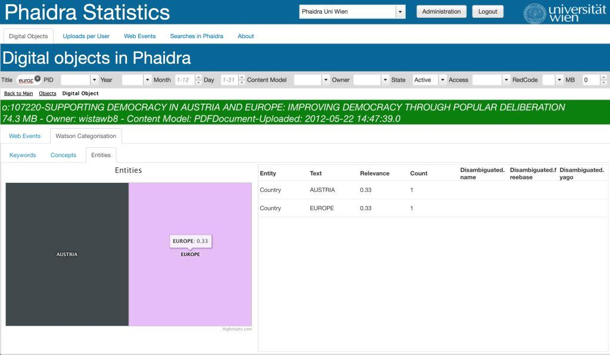

# Watson Integration
Phaidra Statistics has been integrated with IBM Watson. Watson categorizes in real time the **title** of the digital object selected in the Digital Objects page.

Concepts, Keywords and Entities results from Watson are provided as lists and Treemaps.

##Watson Concepts Network Graph
The network is automatically generated from the concepts from Watson Text Analytics. The chart allows for zooming, clustering, drilling-down, and searching.

##Categorisations performed by Watson
###Keywords

###Concepts

###Entities
